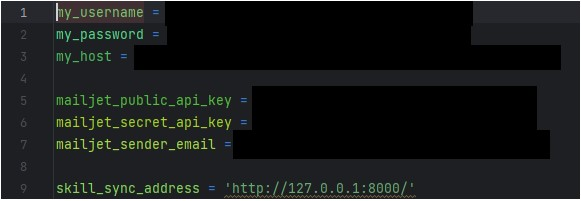
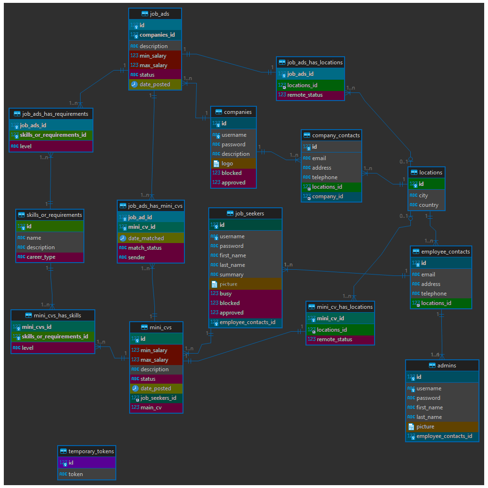

# [A51] Skill Sync [2023]
_Skill, Sync, Match!_


## 🧑‍💻 Contributors 🧑‍💻
Borislav Bonev, Ivaylo Petrov, Andrey Filipov

## 🗺️Overview 🗺️
Skill Sync is a job matching app. The focus of Skill Sync is a backend
with a normalized database. The backend was developed alongside a frontend in less than
a month and the whole code totals over 10,000 lines. While future work involves,
optimizing the code, a great chunk of its logic is necessary for all the functionality
we support.

Skill Sync matches professionals to companies by comparing features of a professional's CV
to a companies posted Job Ad. Matches are mainly determined by two factors:
demanded/offered salary and complementary skills listed in a CV/
requirements listed in a Job Ad.

These two types of users can also maintain some privacy
regarding their activity on the website.

## ⚒️ Functionality ⚒️

### ⭐ Job Match ⭐
The functionality of Skill Sync is best seen by running the frontend.

Two types of users can be created by customers: job seekers and companies.

Job seekers can create multiple CVs and choose one CV with which they can apply for
open positions. CVs include a qualitative description, quantitative minimum and maximum
expected salaries, list of skills that are relevant to the CV and applicable locations for
work. Our application supports CVs and job offers that are fully remote. Job seekers
can have only one main CV active at a time.

Similarly, companies can post job ads that contain information mirroring the CVs.
Most importantly, job ads have salary conditions and required skills. Companies can have
more than one active job ads. What is more, companies can match multiple CVs to a single
job ad.

Our matching logic aimed for user-experience flexibility. Users can adjust how strict
their salary requirements are by extending their search in both directions by a
percentage they input. Moreover, our platform supports searching for potential matches
based on skills/requirements.

'Best' potential matches are 100% matches. 'Very good' potential matches are between 75% and 100%.
'Good' potential matches are 50% to 75%.
If the customer wants to see 'Bad' matches, they receive results for 25% to 50 match.
Users can still see the remaining potential matches by choosing 'Worst'.

Once receiving the results of the search, a user can choose to match to the complementary
offer (CV/Job ad). This informs the opposing user via email that somebody is trying
to match with them alongside with contact details of the one who sent the invitation.
They can also see the pending matches in the frontend, where they can finalize the match.

### 🎛️ Admins 🎛️

A third type of user is the admin user. Only admins can create other admins.
Similar, to the job seeker, the admin is a person and shares a lot of
the attributes a job seeker has, and this is reflected in the normalized database.

The admin current admin functionality allows for managing their own profile,
adding other admins, as well as adding and deleting skills/requirements.
Our vision was that companies and job seekers would use the frontend to
sample from a predetermined database of skills (for CVs) and requirements (for Job ads)

Admins can also delete temporary tokens. Temporary tokens are currently used when a
user has forgotten their password. A confirmation email carrying a 60 minunte token
is sent to the user's given email address. On activating the password reset link,
the user receives a second email with the randomly generated password that they can
use immediately. The token in this case is deleted automatically, but admins can delete
all temporary tokens that were to keep the database clean from unactivated tokens.

## 💿Installation 💿
[To be finalized]

## 🏭 API Structure ️🏭


### 🗿 Models 🗿
We have several models that support OOP principles in our API.
These will be used and expanded on in future iterations of the codebase, as we
transition to a more object-centred approach.

We have models for all types of users as well as class methods that help us
create objects from SQL queries. For the same reason we created models for CVs and Job
ads, as well as skills and requirements.

We have a couple of validators for usernames and passwords. For email validation we use
an extra validator in pydantic called EmailStr.

There are also three token models. One used for functioning of the app, one exclusively
for testing, and one used both for testing and functioning of the app.

### 🗃️ Common Files 🗃️
#### 🗝️ Authorization 🗝️
Getting a user based on a token has been written out here. The main token info
was decided to be placed here, so that it can be found easily.

#### 🌍 Country Validators 🌍

We validate locations used by users of Skill Sync through OpenCageGeocode.
That way we ensure that the location-based part of our searches doesn't fail because
validation kicks during the creation of database entries such as users, CVs, and job ads.

#### ☑️ Job Seeker Status Check ☑️
Checks if a seeker has made a successful match.

#### 📫 Mailing 📫
Supports mailing functionality. Currently, supports four types of emails.
One for password reset requests and one for confirming the new generated password,
as well as two emails each of which handling pending matches.

Users are notified when a complementary user sends them a pending match request.

#### ➗ Separators Validator ➗
Here skills and requirements are validated so that the database and the frontend
can communicate.

#### 🟰 Calculators 🟰
Two important calculators are described in _common_: one that calculates the
percentage match between skills, and one that can change salary threshold by a certain
percent.

Moreover, the percentage calculator is complemented by a sectioner that determines
what is the exact cut-off for 'Best', 'Very good', 'Good', 'Bad', etc. matches are.
This will give us flexibility to respond to user feedback.

These are important for the flexibility of user experience.

### 🛤️ Routers 🛤️
With close to 50 endpoints, we attempted to provide as much functionality as possible.
#### 🎛️ Admin Routers 🎛️
Allows for the aforementioned functionality of adding other admins, deleting tokens,
changing skills/requirements.

#### 🏛️ Company Routers 🏛️
Allows for a company to view all companies, to view and edit its own information,
to view the main cv of a job seeker.

#### 📃 Job Ads Routers 📃
Jobs can be created through here. A specific company's job ad can be seen.
A company can see its own active or archived job ads and edit them.

#### 👤 Job Seeker Routers 👤
Allows for viewing all job seekers. A job seeker can view and edit their own professional
info, as well as to get job ads from companies. Here, professionals can also create,
view, and edit their CVs. Importantly, they can also select their main CV, which
is to be used for matching

#### 🪙 Token Router 🪙
A hidden router that supports authentication and authorization.

#### 💞🏛️ Company Matching Routers 🏛️💞
Where the search, match, viewing pending, and cancelling matches magic happens.

#### 💞👤 Job Seeker Matching Routers 👤💞
Where the search, match, viewing pending, and cancelling matches magic happens.


#### 📄 Further Documentation 📄
Some of the routers accept dynamic variables in the body of requests in JSON format.
We are using FastAPI, a framework that generates parts of the endpoint documentation automatically.
To see what is expected in the body of a request, start the server and go to the server's ip /docs.

With the default setup of our API's server, this additional documentation can be found at
http://127.0.0.1:8000/docs. The automatic documentation supports authentication and authorization
functionality.

### ⚙️ Services ⚙️
#### 🎛️ Admin services  🎛️
Supports basic admin functionality with a couple of crucial methods.

#### 🗝️ Authorization Services 🗝️
Authorization services are described in detail for those inclined towards security.

| Method                                                                  | Parameters                        | Purpose                                                                                                                          |
|-------------------------------------------------------------------------|-----------------------------------|----------------------------------------------------------------------------------------------------------------------------------|
| _verify_password_                                                       | text_password, hashed password    | verifies input password against hashed password in database                                                                      |
| _get_password_hash_                                                     | password                          | used in user account creation and when a randomly generate password is created after email activation-based password reset       |
| _get_password_hash_                                                     | password                          | used in user account creation and when a randomly generate password is created after email activation-based password reset       |
| _get_pass_by_username_admin_ OR _get...seeker_ OR _get...company_       | username                          | finds hashed password in the database based on user type                                                                         |
| _authenticate_admin_ OR _authenticate_seeker_ OR _authenticate_company_ | username, password                | returns user if user exists and if the input password matches the hashed password in the database                                |
| _create_access_token_                                                   | user_data, expiration_delta       | accepts user data such as id, email, etc. to encode a token and sets an expiration time difference for the validity of the token |
| _create_activation_token_                                               | activation_data, expiration_delta | generates a custom token similar to the access token, but only used for a specific purpose, such as password reset               |
| _is_authenticated_                                                      | token                             | decodes a token based on a secret key                                                                                            |
| _is_authenticated_custom_                                               | token                             | decodes a token based on a secret key                                                                                            |
| _password_changer_                                                      | payload, new_password             | uses the payload to find a user's type and updates the hashed password in the database                                           |
| _is_password_identical_by_type_                                         | payload, new_password             | uses the payload's user type and checks the appropriate table's hashed password to the input password                            |
| _generate_password_                                                     | None                              | generates a random password, used in password reset                                                                              |
| _activation_token_exists_                                               | activation_token                  | checks database for activation token, such as one generated during password reset                                                |
| _store_activation_token_                                                | activation_token                  | stores in database an activation token, such as one generated during password reset                                              |
| _delete_activation_token_                                               | activation_token                  | deletes in database an activation token, used to remove used tokens that are not for authentication                              |


#### 🏛️ Company Services 🏛️
Supports basic functionality as well as creating and editing a company.

#### 📃 Job Ads Services 📃
Supports both simple functionality such as selecting relevant bits of information from
the database for job ads, as well as more advanced functionality, such as creating an ad,
updating it, getting relevant CVs, and calculation logic to match with CVs, amongst others.

#### 👤Job Seeker Services 👤
Supports both simple functionality such as selecting relevant bits of information from
the database for users, as well as more advanced functionality, such as creating a CV,
updating the main CV, getting relevant job ads, and even calculation logic to match
with job ads. Other methods are also present.

### 💞🏛️ Company Matching Services 🏛️💞
Hosts the method that sends pending matches and finalizes matches with CVs.
Logic is that if the match does not exist in the junction table between job ads
and CVs it is sent as pending, while if it is already at pending and the one who
made it pending is a job seeker, the match is finalized.

Contains additional helper methods.

#### 💞👤 Job Seeker Matching Services 👤💞
Complementary and similar to the method for matching CVs.
Hosts the method that sends pending matches and finalizes matches with job ads.

Contains additional helper methods.
#### ⚽ Skills and Requirements Services ⚽
Supports basic skills/requirements functionality. Also hosts more advanced functionality
for admins such as deleting unused skills or force deleting skills from both their own
database table and the any CVs or job ads that have them.

#### 📤 Upload Services📤
A routerless service file has been created to harbour upload functionality.
At the current stage, the upload services handles only the upload of pictures/avatars.

| Method           | Parameters          | Purpose                                                                                                                                                    |
|------------------|---------------------|------------------------------------------------------------------------------------------------------------------------------------------------------------|
| _upload_picture_ | payload, image_data | takes the payload to find the table and user in order to insert the image binary data into the database at the appropriate location                        |
| _get_picture_    | user_id, user_group | the method takes user_id and user_group directly and not through the payload because we have considered pictures on our platform to be publicly accessible |
| _is_file_jpeg_   | file                | checks if a file is a jpg/jpeg; uses PIL library, note: this method requires cursor reset (file.seek(0)) after its use                                     |

These services has been compartmentalized in a separate file
and the basic logic for file upload has been written out,
so that it could be used to extend upload features if needed. 

### 🔏 Private Details🔏
When installing Skill Sync, you must create a _private_details.py_ file that holds the
private information regarding the application. The file should be created in the same folder
as _main.py_. For security reasons, we have not uploaded the file but will guide you on what
the file should contain, so that the app can work.

Notably, the file contains the authorized in the SQL database and password,
as well as the Azure address to which the app should connect to access the database.

In addition, _private_details.py_ contains information about the
Mailjet public and secret api keys as well as the sender email that
Mailjet, an automated mailing solution, uses when sending emails through the app.



### 📅 Database Communication 📅
Connections to the active database are described in _job-match-app/data/database.py_

The internal method __get_connection()_ can be used to set how connections are made to the database.

There are four types of queries that are written out in _database.py_

| # | Method                                                                                    | Returns                 | Explanation                                                                                                                             |
|---|-------------------------------------------------------------------------------------------|-------------------------|-----------------------------------------------------------------------------------------------------------------------------------------|
| 1 | _read_query<br/>(sql: str, sql_params=())_                                                | results                 | method which returns the results of a SELECT query                                                                                      |
| 2 | _insert_query<br/>(sql: str, sql_params=())_                                              | last row index          | method which returns the index at which data has been inserted through an INSERT query                                                  |
| 3 | _update_query<br/>(sql: str, sql_params=())_                                              | number of affected rows | method which allows for the modification through an UPDATE or DELETE query                                                              |
| 4 | _update_queries_transaction<br/>(sql_queries: tuple[str, ...], sql_params: tuple[tuple])_ | boolean                 | method which allows for multiple UPDATE and DELETE transactions and returns a boolean on whether the transaction was successful or not. |


## 🔬 Future Work 🔬
### 🔐 Password reset 🔐
A possible addition to the database is to track when a password is last modified and prompt the user to change
their password once a certain threshold has been passed.

Currently, the password reset only asks for the user email and reset the password, stores it in the database
and sends an e-mail to the corresponding e-mail with the new password. This is not ideal
because it is susceptible to trolling. If a user knows somebody's email they can reset the password
for them. While this is not a security breach, it can frustrate users. 

A better way of implementing password reset is to initially send an email link with an activation link,
which when followed leads to the actual password reset.


### 🪙 Token handling 🪙
Currently, the token is issued at login and carries an expiration time.
The token is generated after querying the database.

For example, old admins and malicious
attackers only have 20 minutes to carry out token-based requests with old or hijacked tokens,
while normal users can have sessions of 20 minutes without being reprompted to log back in.

However, it would be better to use shorter access tokens (that do not query every time the database)
) and use refresh tokens, while also whitelisting/blacklisting tokens so that tokens can be managed better.
Even if refresh tokens check against the database if a user exists,
proper implementation can reduce the amount of checks against the database.

If important user changes happen or if we believe the database has been compromised, we can change the JWT in
order to force users to login again and receive their new, updated.

### 💥 Cascade deletions 💥
Deletions should be developed further in the future.
Currently, an admin can delete skills and requirements as admins are part of the
moderation team that supports what skills/requirements other users can pick from
the database to form their CVs/Job ads.

These are implemented through transactions. However, as the database grows,
the complexity and readability of these transactions will shrink. Cascade deletions
directly supported by the database will be the answer to this.

However, it is important to note that this might lead to unexpected behaviour for users.
Great care must be observed to assure that if a modular entry in the database is affected
all relevant information is also deleted.

As the database does not contain dynamic information such as, for example,
the percent of matching between a CV and a Job Ad, updating such variables is not needed.

### 🔧 Refactoring 🔧
The code is over 10,000 lines (frontend and backend), which is both a blessing and a curse.

As the project grew, the SQL-heavy strategy of the project came at a price.
By calling queries for needed on the spot information from a table, our connections
are not optimal.

We recognized the need for an OOP-centric approach midway, however, it would have
taken a significant amount of refactoring to obtain even a fraction of our functionality
before the cut-off date for a project.

In the future, most queries to the database will be culled, and objects would be passed
around in the backend. Future unit tests would reflect the anticipated
emphasis on the OOP paradigm.

Some refactoring needs to be done for typos and method naming.


# Appendix

## 💻 Front-End  💻
[To be updated]

## 🗺️ Database Overview 🗺️

### 📷 Diagram 📷

### 📌 Legend 📌
- Table Connections: primary keys and related foreign keys are in the same color
  - admins: blue
  - job seekers: dark teal
  - companies: dark blue
  - job ads: light blue
  - mini cvs: teal
  - skills and requirements: green
  - locations: dark green
- Conditionals: columns that are used in some sort of conditional logic
  - status, blocked status, approval status*, sender, level, career type*, main cv
  remote status: magenta
  - date posted* and date matched*: dark yellow
  - min_ salary, max salary: dark red
- Long Blob data: columns that are used to store large files
  - picture, logo: dark orange
- String data: columns that contain string information necessary for application functionality
  - username, password, description, etc.: grey
- Unconnected data: primary keys that do not interact with other tables but are necessary for Skill Sync
  - temporary tokens (id): purple

Note*: approval status, career type, date posted, and date matched logic has not been
implemented in the backend but remains for future work. See [future work](README.md#-future-work-).

### 📑 Explanation 📑
Our database supports functionality for three types of users: Admins, Job Seekers, and Companies.
Admins are slightly simpler than job seekers because they do not require the
full functionality of the user experience. They are taken out in a separate table from
other people (job seekers) because admin and job seeker functionality might diverge
even further from the current point of time and it is, thus, logical to separate them as early
as possible in database formation.

Both admins and seekers were deemed to require the same contact information, which would
allow other users (and in the case of admins: developers) to contact them. This is why
their contacts converge in the _employee_contacts_ table.

Similarly, to these users, companies also have contacts,
however one company is allowed more than one address. Currently, database entries only have one
address because some form of conditional logic must be added to choose which address should be
taken from the database. (see [future work](README.md#-future-work-)).

All contacts must have a broader location (city, country), which is validated in the
back-end before input. Location logic is also necessary for job ads and CVs as
they reveal where a company or job seeker (respectively) would like the job to be done.
_job_ads_has_locations_ and _mini_cv_has_locations_ are linking tables which are involved
in the logic if a job ad matches a CV.

The meat of our project is the matching functionality. This is achieved by having many
job ads belonging to one company and many CVs belonging to one job seeker. Then, depending
on whether a job ads requires certain professional skills (_job_ads_has_requirements_)
or a CV advertises that a job seeker already possesses these skills (_mini_cvs_has_skills_)
and what level are these at, an additional link is created to the junction table
_skills_or_requirements_.

There, all the requirements or skills that could be used by job ads or CVs reside.
Currently, the skill/requirement pool is controlled by admins who can add and delete skills
based on user feedback. The reason for this pool is so that when using our front-end,
businesses and seekers can simply cherrypick required skills,
while admins have moderation control over the database.

Skills versus requirements are used to evaluate matches in the backend
so that users receive quantified results in percentages in terms of how good a match was.
After matches pass the match request threshold (which can be set by the user, e.g. "Best",
"Good", etc.) they are recorded in _job_ads_has_mini_cvs_, which also records
who initiated the request (a company or a job seeker) and the match status (at first: "Pending").

The "Pending" match status allows for a user, for example, a company to post a match
request. If a professional then requests the same match, after the back-end retrieves
the "Pending" status, it will set the match as succesful, essentially completing
the essential functionality of the project.

Throughout the database there are numerous conditional columns such as match status and sender
(see [the diagram](README.md#-diagram-) above), who are similarly used or can be used
to expand selection criteria of different services.

Perhaps of greatest importance is that the search for matches can be adjusted by salary,
and users can be blocked.

The database also supports some form of user expression as users can write summaries/descriptions
and images (only 1 MB JPEGs are allowed) can be stored in the database as Large Blobs.
These images can be used as pictures for job seekers and admins and logos as companies,
although, admittedly, there is no logic to differentiate pictures from logos in the back-end.
The difference arises from the naming.

As a side note: job ads and CVs also have a remote status in _job_ads_has_locations_
and _mini_cv_has_locations_ which allows for extended matching. In other words,
an ad or a CV is not limited to its actual location if remote.

## 📫 Mailjet Setup Guide 📫
To use the automatic emailing functionality through endpoint access, you need to set up
a Mailjet account and include the credentials in a _private_details.py_.

The guide to setting up Mailjet is provided on their website. You need to follow
[the getting started guide](https://dev.mailjet.com/email/guides/getting-started/).
Within the guide, it is explained [how to create a Mailjet account](https://app.mailjet.com/signup),
then how to retrieve [both your API and Secret keys](https://app.mailjet.com/account/api_keys).

For the mailing functionality of Skill Sync to function, you need to include four things in
_job-match-app/private_details.py_: the public API, the Secret key, and the sender's email
(the registration email). The fourth is the address of Skill Sync.

```
mailjet_public_api_key = 'XXXXXXXXXXXXXXXXXXXXXXXXXXX'
mailjet_secret_api_key = 'XXXXXXXXXXXXXXXXXXXXXXXXXXX'
mailjet_sender_email = 'XXXXXXXXXXXXXXXXXXXX@XXXX.XXX'
```

You also need to define the address on which the Skill Sync API is run.
```
skill_sync_address = 'XXXXXXXXXXXXXXXXX'
```
For the purposes of a locally run installation, you can substitute the address with localhost.
For example:
```
skill_sync_address = 'http://127.0.0.1:8000/'
```

Our API imports these variables to support mailing functionality, which can be found in
_job-match-app/common/mailing.py_.


## 📦 Library Versions 📦
Python version used for the project is 3.11.

The project has been tested and works on MariaDB 10.11 and MariaDB 11.1.

Library versions of the working project have been provided in the
_requirements.txt_ file. [Will be uploaded at December 7th, the latest]

### 💿 Library Installation Code 💿

```
pip install opencage
pip install python-jose[cryptography] 
pip install passlib
pip install python-multipart
pip install bcrypt
pip install mailjet_rest
pip install jinja2
pip install pillow
pip install pydantic[email]
```

# Thanks!
